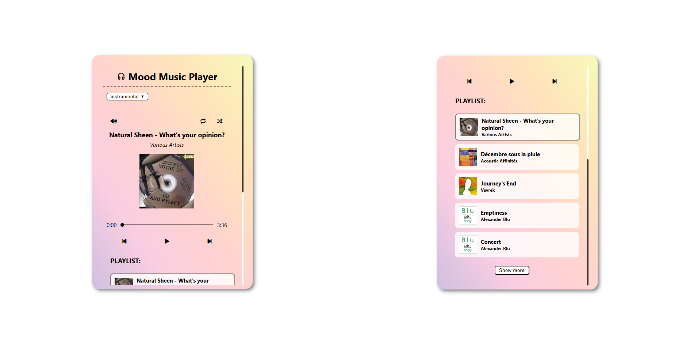
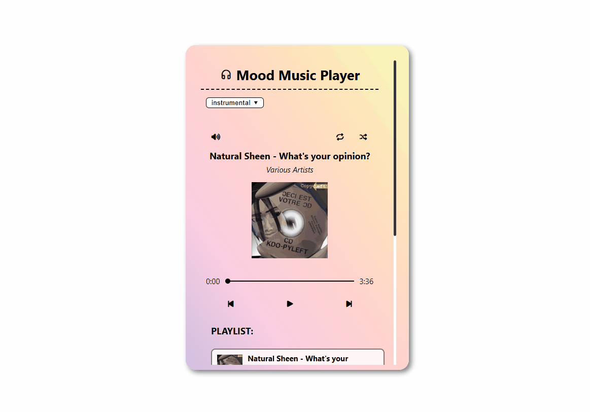

# Mood Music Player

A fully-featured music player with custom controls, category filters, and shuffle functionality with history tracking. Built with vanilla JavaScript and the Jamendo API.



## 🎥 See it in action



_Custom controls, shuffle with history, and dynamic playlist loading_

## ✨ Features

### Playback Controls

- ▶️ **Play/Pause** - Toggle playback with visual state feedback
- ⏭️ **Next/Previous** - Navigate through playlist
- 🔀 **Shuffle mode** - Randomized playback with navigation history
- 🔁 **Repeat mode** - Loop current track
- 🔊 **Volume control** - Custom range slider with mute toggle
- 📊 **Progress bar** - Seek to any point in the track

### Playlist Management

- 🎵 **Dynamic loading** - Show more/Show less buttons for pagination (5 songs at a time)
- 🎯 **Click to play** - Select any track from the visible playlist
- 🎨 **Active track highlighting** - Visual indicator for currently playing song
- 📜 **Scrollable interface** - Custom scrollbar for long playlists

### Music Categories

- 🎹 **Instrumental** - Focus music
- 😌 **Chill** - Relaxing vibes
- 💪 **Workout** - High-energy tracks
- 🌙 **Night** - Evening atmosphere

### UI/UX Features

- 🖱️ **Hover interactions** - Volume control appears on hover
- 🎨 **Active state indicators** - Visual feedback for repeat/shuffle modes
- 📱 **Responsive layout** - Adapts to content
- ⏱️ **Time display** - Current position and total duration

## 🛠️ Technologies Used

- **HTML5** - Structure and semantic markup
- **CSS3** - Gradients, custom scrollbars, hover effects
- **JavaScript (ES6+)** - Async/await, object-oriented state management
- **HTML5 Audio API** - Programmatic audio control
- **Jamendo API** - Free music streaming service
- **Font Awesome** - Icon library

## 🚀 Installation

```bash
git clone https://github.com/shebuildscode/music-player.git
cd music-player
```

### Client ID Setup

1. Get a free client ID from [JamendoAPI.com](https://developer.jamendo.com/v3.0)

2. Rename `config.example.js` to `config.js` and add your client ID key

```javascript
export const CLIENT_ID = "your_client_ID_here";
```

Open `index.html` in your browser.

## 💡 What I Learned

### Audio API Mastery

- **HTML5 Audio element** - Programmatic control of playback, volume, and seeking
- **Audio events** - `timeupdate`, `ended`, and state synchronization
- **Custom controls** - Building UI from scratch instead of using default browser controls
- **Progress synchronization** - Keeping visual slider in sync with actual playback position

### Advanced State Management

- **Complex object state** - Managing playlist data, current song, history, pagination in single object
- **Shuffle history tracking** - Storing navigation path to enable prev/next in random mode
- **History pointer** - `currSongHistoryElement` tracks position in shuffle history for bidirectional navigation
- **Filter state persistence** - Maintaining playback state across category changes

### Algorithm Implementation

- **Shuffle without immediate repeats** - Ensuring random song selection never repeats current track
- **Bidirectional shuffle navigation** - Going backward in shuffle history vs. generating new random track
- **Pagination calculations** - Dynamic start/end based on current page and total songs
- **Auto-load logic** - Expanding visible playlist when navigating beyond current view

### API Integration

- **Data transformation** - Flattening nested API response (`playlists > tracks`)
- **Dynamic filtering** - Fetching different playlists based on user selection
- **Error handling** - Graceful fallback for API failures

## 🐛 Key Challenges

### Implementing shuffle with forward/backward navigation

Standard shuffle generates random songs, but clicking "previous" in shuffle mode should return to the last played song, not generate a new random one. Solved by maintaining `songHistoryIndex` array that stores the order songs were played, and `currSongHistoryElement` pointer to track position in that history. This enables true bidirectional navigation while preserving randomness.

### Synchronizing multiple UI states with audio playback

Player needed to coordinate: play/pause icons, volume icons, mute state, progress bar, time display, and selected track highlighting—all synchronized with HTML5 Audio element. Solved through event-driven architecture where audio events (`timeupdate`, `ended`) trigger UI updates, and user interactions immediately update both UI and audio state.

### Managing playlist expansion with active track visibility

When navigating to a track beyond the visible playlist, needed to automatically expand the view to show that track. Implemented logic to detect when `currSongIndex` exceeds `currPage * showSongs`, triggering `loadSongs()` to reveal the selected track.

### Managing DOM references for hidden elements

When using "show less" to hide parts of the playlist, the selected track could be removed from the DOM, making `querySelector` unable to find it for class removal. Solved by storing a direct reference to the selected element in `playlist.selectedSong`, which persists even when the element is temporarily removed from the DOM, enabling reliable class manipulation across pagination changes.

## 📧 Contact

GitHub: [@shebuildscode](https://github.com/shebuildscode)

E-mail: `shebuildscode@gmail.com`

**_Built as part of my web development learning journey. Check out my other projects!_**
